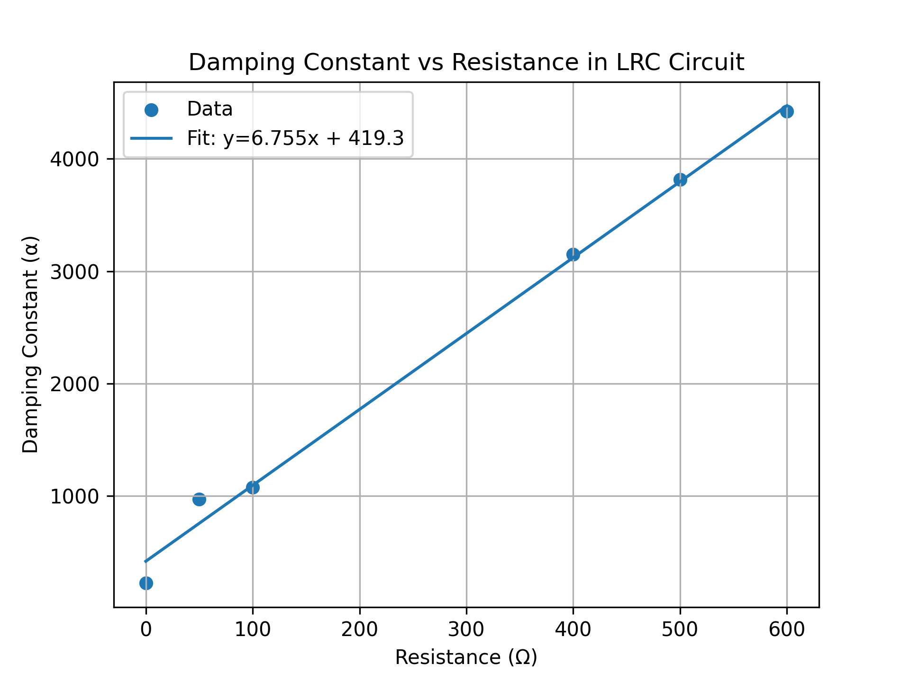

# Analytical Study of Damping and Parasitic Resistance in a Series LRC Circuit
A quantitative experimental study of transient response in electrical oscillatory systems
## Objective
To investigate the transient response of a series L–R–C circuit and determine the damping constant as a function of resistance, along with estimating the inductance and parasitic resistance of the inductor.

---

## Background & Theory

A series L–R–C circuit exhibits oscillatory behaviour analogous to a damped mechanical oscillator. Energy alternates between:
- Electric field (capacitor)
- Magnetic field (inductor)

In the presence of resistance, energy dissipates via Joule heating, leading to damped oscillations.

The governing differential equation:

$$\frac{d^2q}{dt^2} + \frac{R}{L}\frac{dq}{dt} + \frac{q}{LC} = 0$$

This represents a second-order linear differential equation analogous to a damped harmonic oscillator in mechanical systems.

For an underdamped system:

$$\frac{R}{2L} < \frac{1}{\sqrt{LC}}$$

Logarithmic decrement:

$$\delta = \ln\left(\frac{A_1}{A_2}\right)$$

Damping constant from measurement:

$$\alpha = \frac{\delta}{T}$$

Damping constant:

$$\alpha = \frac{R_{ext} + R_L}{2L}$$

The quality factor (Q) is defined as:

$$Q = \frac{\omega_0}{2\alpha} \approx \frac{\pi}{\delta}$$

where $\omega_0$ is the natural angular frequency of the circuit.
---

## Experimental Setup

- Inductor (L)
- Capacitor (C)
- Variable resistor (R)
- Function generator (square wave input)
- Digital Storage Oscilloscope (DSO)

The circuit was configured in series, and the voltage across the capacitor was monitored using an oscilloscope.

---

## Methodology

1. Construct a series LCR circuit  
2. Apply a square-wave signal  
3. Observe damped oscillations on the oscilloscope  
4. Record successive peak amplitudes (A₁, A₂) and time period (T)  
5. Calculate logarithmic decrement (δ) and damping constant (α)  
6. Repeat for different resistance values  

---

## Observations

| R (Ω) | A₁ (V) | A₂ (V) | T (μs) | δ | α (s⁻¹) | Q |
|------|--------|--------|--------|----|---------|----|
| 0    | 7.84   | 7.36   | 280    | 0.063 | 225.0 | ∞ |
| 50   | 12.70  | 7.52   | 540    | 0.524 | 970.4 | 6.0 |
| 100  | 9.84   | 5.52   | 536    | 0.578 | 1078.5 | 5.43 |
| 400  | 12.20  | 2.20   | 544    | 1.713 | 3148.9 | 1.83 |
| 500  | 10.40  | 1.30   | 545    | 2.079 | 3814.7 | 1.51 |
| 600  | 9.60   | 0.85   | 548    | 2.424 | 4423.4 | 1.30 |

---

## Graph Analysis

The linear variation of the damping constant (α) with resistance (R) confirms the theoretical model:

$$\alpha = \frac{1}{2L}R_{ext} + \frac{R_L}{2L}$$

- Slope $(m)$: $6.46 \times 10^{-3} \ \text{s}^{-1}\Omega^{-1}$  
- Intercept $(c)$: $548.2 \ \text{s}^{-1}$
---

## Results

Inductance:

$$L = \frac{1}{2m} = 77.4 \ \text{mH}$$

Parasitic Resistance:

$$R_L = \frac{c}{m} = 84.9 \ \Omega$$

These values are consistent with expected non-ideal characteristics of practical inductors.

---

## Key Inferences

- Damping increases linearly with resistance  
- Non-zero intercept confirms internal resistance in the inductor  
- Quality factor decreases as resistance increases  

---

## Applications

- RF filter design  
- Automotive ignition systems  
- Sensor calibration  

---

## Discussion

The observed linear dependence of the damping constant on resistance validates the theoretical model of an LRC system. The nonzero intercept indicates the presence of parasitic inductor resistance, which becomes significant at low external resistance values.

Deviations from ideal behaviour may be attributed to non-ideal components, including dielectric losses in the capacitor and frequency-dependent resistance in the inductor.

The consistency between experimental data and theoretical prediction supports the validity of the adopted measurement and analysis techniques.

## Error Analysis

- Capacitor tolerance (±10%)  
- Skin effect in an inductor  
- Oscilloscope measurement uncertainty (~1–2%)  

---

## References

1. Sears and Zemansky, *University Physics with Modern Physics*, 15th Edition – Chapter 31 (Alternating Current) and Section 14.7 (Damped Oscillations)  
2. H.D. Young and R.A. Freedman – Standard LCR circuit analysis and damping theory  

## Author

Samuel Gardonis  
B.Sc. Physics, St. Xavier’s College, Mumbai
## Author

Samuel Gardonis  
B.Sc. Physics, St. Xavier's College, Mumbai  
[📄 View Full Lab Report](/Samuel_Gardonis_LRC_Analysis.pdf)
